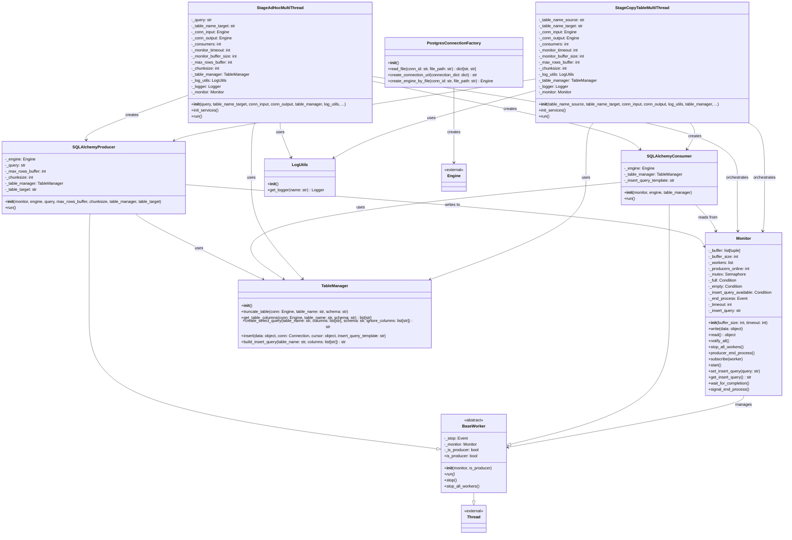

# Data Tools - Multithreaded ETL Framework

A high-performance, multithreaded ETL (Extract, Transform, Load) framework designed for PostgreSQL databases using Python and SQLAlchemy. This framework implements a producer-consumer pattern with thread synchronization to efficiently process large datasets.

## 🏗️ Architecture Overview

The framework is built around a producer-consumer architecture with the following key components:

### Core Components

- **Monitor**: Central coordinator that manages thread synchronization and data flow
- **Workers**: Producer and consumer threads that handle data processing
- **Connection Management**: Factory pattern for database connections
- **Templates**: High-level ETL orchestration classes
- **Utilities**: Database operations and logging support

## 📁 Project Structure

```
src/
├── connection/
│   ├── __init__.py
│   └── postgres_connection_factory.py    # Database connection factory
├── monitors/
│   ├── __init__.py
│   └── monitor.py                        # Thread coordination and synchronization
├── workers/
│   ├── __init__.py
│   ├── base_worker.py                    # Abstract worker base class
│   ├── sqlalchemy_producer.py           # Data producer worker
│   └── sqlalchemy_consumer.py           # Data consumer worker
├── templates/
│   ├── __init__.py
│   ├── template_stage_ad_hoc_query_multithread.py    # Ad-hoc query ETL template
│   └── template_stage_copy_table_multithread.py     # Table copy ETL template
├── utils/
│   ├── log/
│   │   ├── __init__.py
│   │   └── log_utils.py                  # Logging utilities
│   └── table/
│       ├── __init__.py
│       └── table_manager.py              # Database table operations
├── resources/
│   └── postgres_connections.json         # Database connection configurations
└── __init__.py
```

## 🔧 Core Classes

### Monitor
Central coordinator that manages the producer-consumer pattern:
- **Buffer Management**: Thread-safe data buffer with configurable size
- **Worker Coordination**: Manages producer and consumer thread lifecycle
- **Synchronization**: Uses threading primitives for safe concurrent operations

### BaseWorker (Abstract)
Base class for all worker threads:
- Extends Python's `Thread` class
- Provides common functionality for producers and consumers
- Abstract `run()` method for specific implementations

### SQLAlchemyProducer
Data producer that reads from source databases:
- Streams data using SQLAlchemy with configurable chunk sizes
- Optimized for large datasets with `stream_results` and `yield_per`
- Generates insert queries dynamically based on source schema

### SQLAlchemyConsumer
Data consumer that writes to target databases:
- Processes data from the monitor's buffer
- Executes batch inserts with transaction management
- Handles errors with automatic rollback

### PostgresConnectionFactory
Database connection management:
- Reads connection configurations from JSON files
- Creates SQLAlchemy engines with PostgreSQL-specific optimizations
- Supports multiple database connections

### TableManager
Database utility operations:
- Table schema inspection and column extraction
- Dynamic query generation for SELECT and INSERT operations
- Table truncation and data insertion with transaction support

## 📋 ETL Templates

### StageAdHocMultiThread
For executing custom SQL queries:
```python
template = StageAdHocMultiThread(
    query="SELECT * FROM source_table WHERE condition",
    table_name_target="target_table",
    conn_input=input_engine,
    conn_output=output_engine,
    table_manager=table_manager,
    log_utils=log_utils,
    consumers=4,  # Number of consumer threads
    chunksize=20000  # Rows per batch
)
template.run()
```

## Mermaid Class Diagram



## How to use:

1. Install Python 3.10.11;
2. Install Python requirements;
```
pip install -r requirements.txt --no-cache-dir
```
3. Run database docker compose:
```
docker compose -f postgres_compose.yml up -d
```
4. Run main.py or main2.py
```
python main.py
```